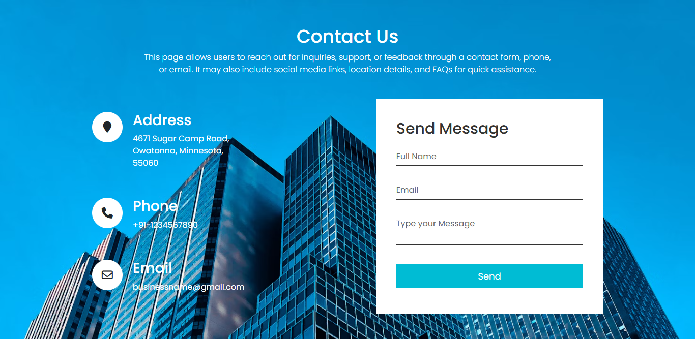
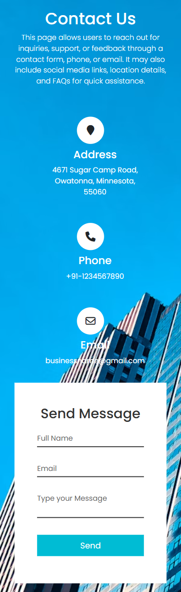

# 📞 Contact Us Page  

> A sleek and **responsive Contact Us page** built with **HTML, CSS, and JavaScript**, featuring form submissions powered by [Getform.io](https://getform.io/).  

<p align="center">
  
</p>

---

## 🚀 Live Preview  

🔗 **[Live Demo](https://aerocotton.github.io/Contact-us-page/)**  
🔗 **[GitHub Repository](https://github.com/AeroCotton/Contact-us-page)**  

---

## ✨ Features  

✅ **Fully responsive** on all devices  
✅ **Modern & stylish** UI design  
✅ **Email submission** via [Getform.io](https://getform.io/)  
✅ **Custom CSS animations** for smooth interactions  
✅ **Form validation** with JavaScript  
✅ **Bootstrap 5 integration** for enhanced styling  
✅ **Lightweight and fast**  

---

## 🛠 Technologies Used  

<p align="center">
  <a href="https://developer.mozilla.org/en-US/docs/Web/HTML">
    
  </a>
  <a href="https://developer.mozilla.org/en-US/docs/Web/CSS">
    
  </a>
  <a href="https://developer.mozilla.org/en-US/docs/Web/JavaScript">
    
  </a>
  <a href="https://getbootstrap.com/">
    
  </a>
  <a href="https://getform.io/">
    
  </a>
</p>

---

## 📷 Screenshots  

| **Desktop View** | **Mobile View** |
|-----------------|----------------|
|  |  |

---

## 📥 Installation & Setup  

Follow these steps to **clone and set up** the project:  

### **Clone the Repository**  
```bash
git clone https://github.com/YOUR_USERNAME/Contact-us-page.git
cd Contact-us-page
